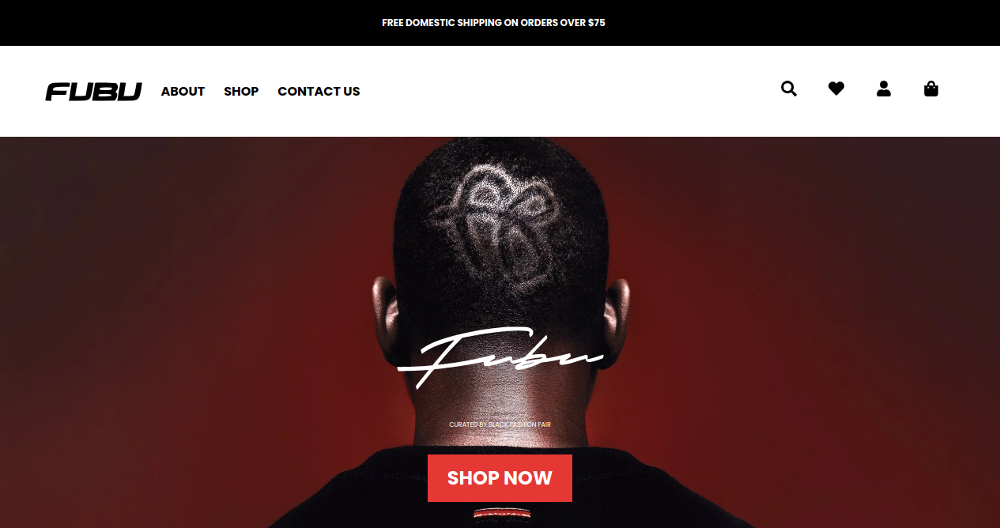

# MyFubuStore - Your Ultimate Urban Wear Destination

Welcome to MyFubuStore, the premier online destination for all your urban wear needs. Our curated collection of street-inspired fashion will elevate your style and keep you ahead of the urban fashion curve. Whether you're looking for the latest trends in streetwear, comfortable activewear, or statement accessories, MyFubuStore has you covered.

Live demo: https://myfubu-store.vercel.app/

## Screenshot

## Table of Contents

- [Introduction](#introduction)
- [Features](#features)
- [Products](#products)
- [How to Order](#how-to-order)
- [Payment Options](#payment-options)
- [Shipping and Delivery](#shipping-and-delivery)
- [Returns and Exchanges](#returns-and-exchanges)
- [Contact Us](#contact-us)

## Introduction

At MyFubuStore, I understand that urban fashion is more than just clothing; it's a lifestyle. My website is designed to provide you with a seamless shopping experience, from browsing through our handpicked collection to receiving your order at your doorstep. I pride myself on offering high-quality, trendy, and comfortable urban wear that resonates with the pulse of the city streets.

## Features

- **Curated Selection**: My team of fashion experts scours the urban fashion scene to curate a diverse and up-to-date collection that suits various styles and preferences.

- **User-Friendly Interface**: My website's intuitive interface ensures that you can effortlessly navigate through categories, filter options, and find the perfect pieces to express your individuality.

- **Secure Shopping**: Your privacy and security are paramount. I employ the latest encryption technology to ensure your personal and payment information is safe and secure.

- **Responsive Customer Support**: Have questions or need assistance? My dedicated customer support team is always ready to help you with your inquiries, orders, and any concerns you may have.

## Products

Discover a wide range of urban wear essentials that cater to every aspect of your style journey:

- **Streetwear**: From graphic tees to distressed denim, our streetwear collection captures the essence of urban culture and self-expression.

- **Activewear**: Stay comfortable while looking stylish with our selection of activewear. Whether you're hitting the gym or exploring the city, we have the perfect pieces for you.

- **Footwear**: Complete your look with our trendy and versatile footwear options, from sneakers that stand out to boots that make a statement.

- **Accessories**: Elevate your style with our range of urban accessories, including hats, sunglasses, backpacks, and more.

## How to Order

Ordering your favorite urban wear from MyFubuStore is a breeze:

1. **Browse**: Explore my categories and collections to find items that resonate with your style.

2. **Select**: Click on the products you love to view more details, available sizes, and colors.

3. **Add to Cart**: Choose your preferred size and color, then click "Add to Cart."

4. **Review Cart**: Review your selected items in the cart, make any necessary adjustments, and proceed to checkout.

5. **Checkout**: Provide your shipping information and select your preferred payment option.

6. **Confirm**: Review your order details and confirm your purchase.

## Payment Options

I offer a range of secure payment options to make your shopping experience convenient:

- Stripe

## Shipping and Delivery

I'm committed to getting your order to you as quickly as possible:

- **Shipping**: I offer both standard and expedited shipping options.
- **Tracking**: You'll receive a tracking number to monitor your order's journey.
- **International Shipping**: I ship to most countries worldwide.

## Returns and Exchanges

Your satisfaction is my priority. If you're not completely satisfied with your order:

- **Returns**: Initiate a return within 30 days of receiving your order.
- **Exchanges**: Exchange items for a different size within 60 days.

## Contact Me

Have questions or feedback? I'd love to hear from you.

- **Support**: ombu.oneal@yahoo.com
- **Phone**: +234-70-6048-7713
- **Follow Me**: Connect with me on [Twitter](https://www.twitter.com/ReactRuler)
